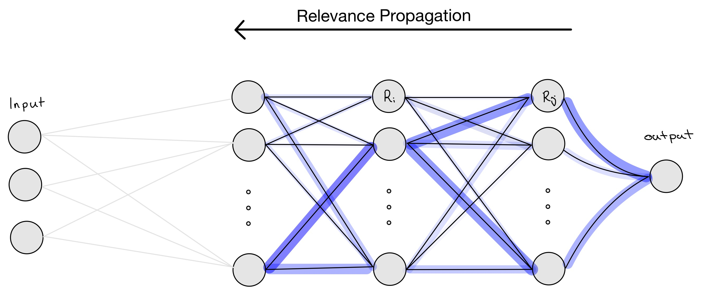
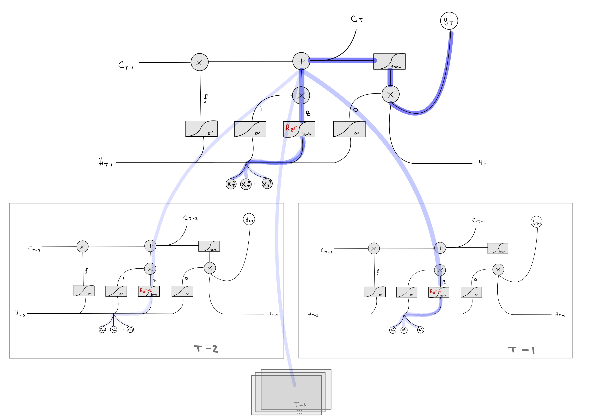

<p align="center"></p>
<div align="center">


[](./License)

</div>

---

> **Deep Recurrent Factor Model** is a term coined by the authors of the paper [*Deep Recurrent Factor Model: Interpretable Non-Linear and Time-Varying
> Multi-Factor Model*](https://arxiv.org/pdf/1901.11493.pdf). The authors challenge the idea of linear factor models to predict stock returns and use Long-Short-Term Memory networks (LSTM) in conjunction with layer-wise-relevance propagation (LRP) to construct a time-varying factor model that outperforms equivalent linear models, whilst providing insights into the relvance of particular factors in the prediction.


<div align=center>
This repository provides <b>classes</b>, <b>functions</b> and <b>notebooks</b>
to test <b>Deep Recurrent Factor Models</b> on the US-Stock market.
</div>

  
  

---

  

# [Contents](#contents)
 - [Basic Overview](#basic-overview)
 - [Getting Started](#getting-started) 
    - [Installing Dependencies](#intalling-dependencies)
    - [Building a Model](#build-a-model)
    - [LRP](#lrp)
 - [Example](#example)
 - [Data](#data)
 - [References](#references)
 - [Contact](#contact)


# [Basic Overview](#basic-overview)
Welcome to the **Deep Recurrent Factor Model** Repository. This repository introduces a fresh approach to deep feed-forward LSTM networks, featuring a new layer class that enables easy layerwise relevance propagation. 

By building upon the familiar `keras.layers` module, this repository allows you to create deep LSTM networks and fascilitate LRP.
The key highlight is the `CustomModel` class, which takes care of the complex task of backpropagating relevance through any variation of custom `Input`,`LSTM`, 
`Dense` or `Dropout` layers, which are built using the [Functional API by Keras](https://keras.io/guides/functional_api/). 

 In an [Example](#example) we explore and replicate the approach suggested in the paper [*Deep Recurrent Factor Model: Interpretable Non-Linear and Time-Varying Multi-Factor Model*](https://arxiv.org/pdf/1901.11493.pdf) to test our implementation on the US stock market.


# [Getting Started](#getting-started)

In order to get started clone the GitHub repository to your local machines:
```bash
git clone https://github.com/ACM40960/project-mkaywins.git
```

## [Intalling Dependencies](#intalling-dependencies)
- Make sure to have python 3.11+ installed - if not, download the  [latest version of Python 3](https://www.python.org/downloads/).

- Install all necessary dependencies:

    ```bash
    cd ./project-mkaywins
    pip install -r requirements.txt
    ```

## [Building a Model](#build-a-model)

If you want to build your own deep LSTM model, then you need to 
use the [Functional API by Keras](https://keras.io/guides/functional_api/). This is shown in the following example:

```python
# Build an example model
import pandas as pd
import numpy as np
import matplotlib.pyplot as plt

timesteps = 5
input_dim = 16
input_shape = (timesteps, input_dim)

#1) Create input layer
input_layer = Input(shape=input_shape, name="Input")

#2) Create a CustomLSTM layer
lstm_output, hidden_state, cell_state = CustomLSTM(units=32, return_sequences=False,
                                                return_state=True,
                                                kernel_regularizer=L2(0.02),
                                                name="CustomLSTM_1")(input_layer)
#3) Apply dropout to LSTM output
dropout1 = Dropout(0.2)(lstm_output)

#4) Create a Dense layer
dense1 = Dense(16, kernel_regularizer=L2(0.02), name="Dense_1")(dropout1)

#5) Apply dropout to dense1 output
dropout2 = Dropout(0.2)(dense1)

#6) Create the final output layer
output_layer = Dense(1, kernel_regularizer=L2(0.02), name="Dense_2_Final")(dropout2)

# Create an instance of your custom model
custom_model = CustomModel(inputs=input_layer, outputs=output_layer)

# Compile the model
custom_model.compile(optimizer='adam', loss='mean_squared_error', metrics=['mae'])

# # Generate some example training data (replace this with your actual data)
num_samples = 100
X_train = np.random.rand(num_samples, timesteps, input_dim)
y_train = np.random.rand(num_samples, 1)

# Train the model
custom_model.fit(X_train, y_train, epochs=10, batch_size=32)

```

## [Layerwise Relevance Propagation (LRP)](#lrp)

To backpropagate relevance from either Dense to Dense, LSTM to Dense or Dense to LSTM, we use the approach suggested by [Arras et al. (2017)](https://arxiv.org/abs/1706.07206), namely 

```math
R_{i\leftarrow j} = \frac{z_i \cdot w_{ij} + \frac{\epsilon \cdot \text{sign}(z_j) + \delta \cdot b_j }{N}}{z_j + \epsilon \cdot \text{sign}(z_j)} \cdot R_j,
```

where 
- $R_j$ represents the relvance of nodes in upper layers, 
- $z_i$ is the activation of nodes in the lower layer
- $z_j$ is the activtion of nodes in the upper layer
- $w_{ij}$ are the weights connecting nodes from lower and upper layers
- $\epsilon$ is a small number to avoid division by 0 - it is usually set to 0.001
- δ is a multiplicative factor that is either 1 or 0 (see [details](https://arxiv.org/abs/1706.07206))

Here is an illustration of how the relevance is backpropagted in the network.




For the backpropagation of relevance in a LSTM cell we provide two approaches:

1. the approach suggested by [Arras et al. (2019)](https://arxiv.org/pdf/1909.12114.pdf), which discountes the relevance scores by 'forget factors' of the LSTM cell at each point in time.

2. the approach suggested by [Arjona-Medina, et al. (2019) - A8.4.2](https://arxiv.org/pdf/1806.07857.pdf), who make a list of assumptions on the LSTM cell archticeture and characteristics themselves to facilitate relevance propagation without disounting relevance scores through 'forget factors' of the LSTM cell

Both approaches use the "signal takes it all" approach to dealing with distribution of relevance in multiplicative connections within the LSTM cell (refer to the paper for [details](https://arxiv.org/pdf/1909.12114.pdf)). Here is an illustration of how the relevance is backpropagated through each LSTM cell.



After having fit the model either by the customary `model.fit()` method, we can proceed to compute the relevance for each input feature. Note, as the input to the model was of dimensions `(timesteps, input_dim) = (5, 16)`, the relevance will have the same dimensions.


```python
# Create sample input data to test LRP

batch_size = 1  # Number of samples in a batch
timesteps = 5  # Number of time steps
input_dim = 16  # Dimensionality of each input

input_data = np.random.rand(1, timesteps, input_dim) # sample input

# Relevance for each input feature based on the provided input data
print(custom_model.backpropagate_relevance(input_data))

```

To summarise the relevance across the `timesteps`, we take the average for each input factor across time.

```python
relevance_aggregated = np.mean(np.array(relevance), axis=1)
```

# [Example](#example)

- [Replication of Experiments in <i>'Deep Factor Models'</i>](./Notebooks/DeepFactorModels.ipynb)
# [Data](#data)

- We gatherd the factor data from the openly available factor data set provided by [Andrew Y. Chen and Tom Zimmermann](https://www.openassetpricing.com/data/)

-  You can find a description of the factor data [[here]](https://docs.google.com/spreadsheets/d/1WLiuWh4Uq_0wK230yXpczsb_PON0z91e_TAcUtb0rkU/edit?pli=1#gid=312865186)

- How we try to map features from the [Open Asset Pricing Data Set](https://www.openassetpricing.com/data/) to factors used in the [paper on deep factor models]((https://arxiv.org/pdf/1901.11493.pdf)) is described [[here]](./static/Data/FactorDescription.md).

# [References](#references)


---

# [Contact](#contact)

- Alissia Hrustsova:  alissia.hrustsova@ucdconnect.ie
- Maximilian Kuttner: maximilian.kuttner@ucdconnect.ie
